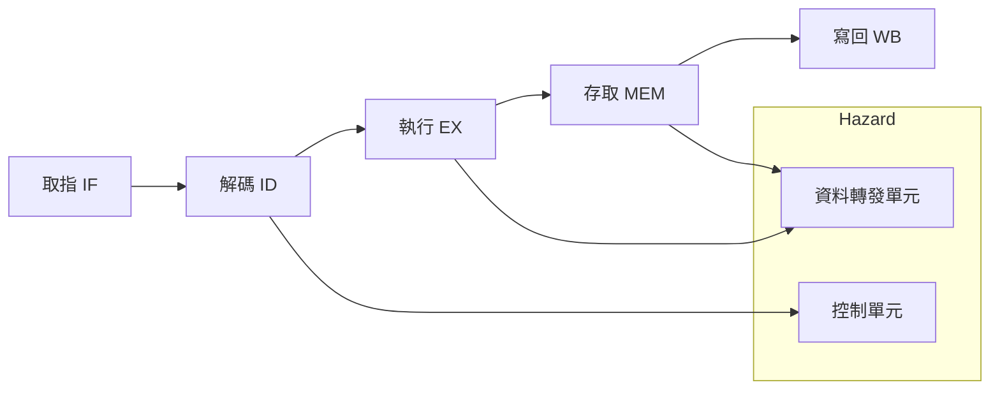

# Pipelined MIPS Lite CPU

## 專案介紹

本專案實現了一個 **五級 Pipeline 的 MIPS-Lite 32 位元 CPU**，設計目的是透過 Pipeline 技術提升指令執行效率，讓處理器在每一個時脈週期同時處理多條指令的不同階段。

本 CPU 採用 **精簡指令集**，支援的指令包含：

- 算術/邏輯運算：`ADD`, `SUB`, `AND`, `OR`, `SLT`, `SLL`
- 立即數運算：`ANDI`
- 記憶體訪問：`LW`, `SW`
- 控制流程：`BEQ`, `J`, `JR`
- 乘法與特殊暫存器：`MULTU`, `MFHI`, `MFLO`

在流水線設計中，本專案特別處理了 **資料冒險 (Data Hazard)** 與 **控制冒險 (Control Hazard)** 問題：

- **資料冒險**：透過 **資料轉發 (Forwarding)** 與必要時插入一個暫停週期解決 Load-Use Hazard。
- **控制冒險**：採用「假設不分支」的策略，若分支成立，清除已取出的指令。
- **結構冒險**：使用 **哈佛架構**，分離指令與資料記憶體，避免衝突。

---

## 系統架構圖

CPU 採用經典的五級 Pipeline 架構：

每個階段之間透過 **Pipeline regester** (IF/ID, ID/EX, EX/MEM, MEM/WB) 傳遞訊號，確保並行執行不互相干擾。

---

## 模組說明

- **IF（取指階段）**

  - 程式計數器 (PC)、指令記憶體
  - 支援順序執行、分支位址、跳躍位址的選擇

- **ID（解碼階段）**

  - 指令解碼
  - 暫存器檔讀取（32 個 32 位元暫存器，$zero 恆為 0）
  - 控制單元產生控制訊號
  - 立即值符號延伸 / 零延伸

- **EX（執行階段）**

  - ALU：支援算術/邏輯/位移運算
  - ALU 控制：由 `ALUOp` 與 `funct` 解碼
  - 乘法器與 HI/LO 暫存器：支援 MULTU, MFHI, MFLO
  - 資料轉發 (Forwarding)

- **MEM（存取階段）**

  - 資料記憶體 (1KB，小端序)
  - `LW` 與 `SW` 指令

- **WB（寫回階段）**

  - 多工器選擇：ALU 結果 或 記憶體讀值
  - 寫回暫存器檔

- **Pipeline regester**
  - IF/ID、ID/EX、EX/MEM、MEM/WB：確保訊號在階段間正確傳遞
  - 支援 **暫停 (Stall)** 與 **清空 (Flush)**

---

## 模擬方式（使用 ModelSim）

1. **匯入專案**

   - 將所有 Verilog 檔案與 `tb_Pipelined.v` 測試平台加入 ModelSim 工程。

2. **編譯與模擬**

   - 編譯專案後，執行 `vsim work.tb_Pipelined`。
   - 測試平台會自動產生時脈 (10ns 週期) 與重置信號。

3. **初始化記憶體與暫存器**

   - 使用 `$readmemh` 載入：
     - `instr_mem.txt`：指令記憶體
     - `data_mem.txt`：資料記憶體
     - `reg.txt`：暫存器初始值

4. **觀察結果**
   - 使用波形視窗觀察 PC、暫存器、ALU 輸出、記憶體存取。
   - 測試平台含 `$display`，每個時脈列印指令執行情況。

---

## 測試方式

- **單指令測試**
  - 確認 ADD、SUB、AND、OR、SLT 等算術/邏輯指令結果正確。
- **記憶體測試**
  - 使用 LW 載入資料，SW 儲存資料，比對暫存器與記憶體內容。
- **控制流測試**
  - 測試 BEQ、J、JR，觀察 PC 是否正確跳轉，未執行的指令是否被清空。
- **資料冒險測試**
  - 驗證 Forwarding 機制，特別是 `LW` 後立即使用的情況。
- **特殊指令測試**
  - MULTU 後搭配 MFHI/MFLO，確認 HI/LO 結果是否正確。

測試結果顯示，本 CPU 在各項情境下皆能正確執行，流水線冒險處理運作如預期，完整展現 MIPS-Lite 流水線 CPU 的設計原理。
